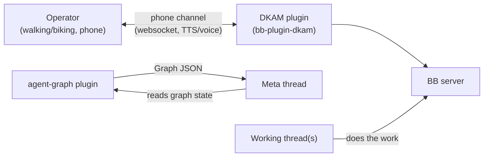

# Architecture (technical surface)

DKAM is a headless BB plugin: one backend entry (`server.ts`) loaded by the BB
server, no frontend bundle, no `bb.app`. Everything below is the technical
shape of that single container plus its external relationships.

> DDD artifacts (bounded contexts, ubiquitous language) live on the separate
> domain surface: [DOMAIN-MODEL-L1.md](DOMAIN-MODEL-L1.md) and
> [domain-architecture/](domain-architecture/).

## System context (C4 L1)

Full detail: [technical-architecture/c4/context.md](technical-architecture/c4/context.md).

## Containers (C4 L2)

| Container | Runtime | Tech | Entry |
|---|---|---|---|
| DKAM plugin server | inside BB server process | TypeScript on the BB Plugin SDK | `server.ts` (default export factory) |
| Phone channel page | operator's phone browser | HTML + websocket client, TTS via Web Speech or provider API | served over `bb.http.experimental_websocket("/dkam")` |
| Drift watcher (TODO) | BB background service | same plugin process | `bb.background.service("drift-watcher")` |

Full detail: [technical-architecture/c4/container.md](technical-architecture/c4/container.md).

## Components (C4 L3)

Inside the plugin server entry:

- **CLI** — `bb dkam status|watch|unwatch|recap` via `bb.cli.register(defineCli(...))`
- **Agent tool** — `state_snapshot`, zod-parameterized, registered with `bb.agents.registerTool`
- **Settings** — `bb.settings.define`: TTS API key (secret), operator mode, episode length
- **Watch registry** — `bb.storage.kv` (moving to `bb.storage.database()` as state grows)
- **Agent-graph client** — `GET {loopbackBaseUrl}/api/v1/plugins/agent-graph/http/graph?threadId=<id>`

Detail lives inline in `server.ts` for now; component-level C4 will be added
when the drift watcher and phone channel land.

## Deployment (C4 L4-topology)

DKAM installs as a BB plugin from git (`bb plugin install .` on a path, or a
git URL for managed installs). It runs wherever the BB server runs; the phone
channel must be reachable from the operator's phone, which BB Connect port
shares provide remotely. See [technical-architecture/c4/deployment.md](technical-architecture/c4/deployment.md).

## Deployment pipeline (two-stage)

Staging/production scripts live in `scripts/staging/` (deploy, e2e, teardown;
branch name is the staging identity). The mandate and conventions:
`~/.agents/agents-md-detail/two-stage-pipelines.md`.

## Tech stack

See [technical-architecture/tech-stack.md](technical-architecture/tech-stack.md).