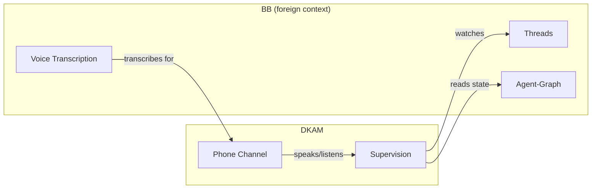

# Domain Model — L1 (prose glossary)

DKAM is about keeping an agent aligned with an operator who cannot watch it.
The language below is how we talk about the domain. Diagrams here are
conceptual groupings only; formal ERDs and invariants live at
[domain-architecture/DOMAIN-MODEL-L2.md](domain-architecture/DOMAIN-MODEL-L2.md).

## Bounded contexts (conceptual)

- **Supervision** — the core of DKAM: watching working threads against stated
  intent, managing episodes, queuing consequential actions.
- **Phone Channel** — everything the operator hears and says; delivery and
  capture, not judgment.

## Ubiquitous language (L1)

- **Meta thread** — the operator's interface thread. It holds the intent
  anchor and runs the metacognitive prompts. It is not the thread doing the
  work.
- **Working thread** — an ordinary BB thread doing the actual coding work,
  muted to the operator. DKAM supervises it; it never supervises itself.
- **Episode** — one capped working run (~5-10 minutes). Episodes end at a
  boundary where the working thread must re-ground.
- **Intent anchor** — the operator's own words stating what the current
  episode is for. The reference point for drift judgment.
- **State snapshot** — a compact summary of what a working thread is doing
  right now, pulled on demand ("where am I"). Answer, not narration.
- **Drift** — divergence between the working thread's current activity and
  the intent anchor. Detectable only against an anchor; without one there is
  no drift, only activity.
- **Re-grounding** — what happens at an episode boundary: the working thread
  re-states alignment (or the operator re-states intent) before continuing.
- **Consequential action** — a commit, push, or delete. Deferred and queued
  with a heads-up; reviewed at a stop or back at the desk.
- **Phone channel** — the websocket-served HTML page carrying recaps and
  alerts to the operator and voice back from them.

## Business rules (natural language)

1. DKAM never narrates agent output; it answers "where am I" and interrupts.
2. Drift is always judged against a stated intent anchor, never against a
   generic notion of "on track".
3. A working-thread run is capped by episode length; crossing the boundary
   forces re-grounding.
4. Consequential actions from watched threads are never silent — they are
   queued with a heads-up.
5. The operator's attention is the scarcest resource; every interruption must
   be worth stopping for.

## Avoid

- Do not call the meta thread a "controller" or the working thread a "slave";
  the meta/working pair is the stable vocabulary.
- Do not use "alert" and "notification" interchangeably: an alert is a drift
  or boundary event delivered on the phone channel; other output is a recap
  or snapshot.
- Do not say "timeout" for an episode boundary — a boundary is a managed
  transition, not a failure.

## Vocabulary stability

Ephemeral or exploratory decisions do not live here; they go in
[adr/](adr/). Half-formed ideas go in [musings/](musings/).