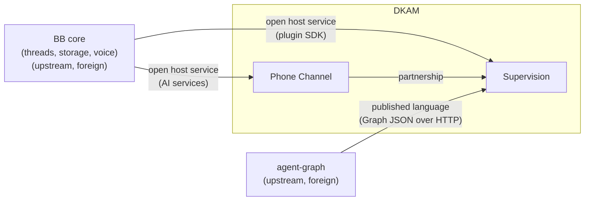

# Bounded contexts and their relationships (context map)

## Contexts

| Context | Owns | Notes |
|---|---|---|
| Supervision | watch registry, intent anchors, episodes, drift judgment, action queue | the core |
| Phone Channel | websocket, served HTML, TTS/voice I/O | delivery surface for Supervision |

## Relationships

- **Supervision ← BB core** (`conformist` in practice): DKAM consumes the
  Plugin SDK as given — `bb.cli`, `bb.agents`, `bb.storage`,
  `bb.background.service`, `bb.settings`. No adaptation layer; we follow
  BB's model.
- **Supervision ← agent-graph** (`anticorruption layer`): the single
  integration point is
  `GET /api/v1/plugins/agent-graph/http/graph?threadId=<id>` returning the
  `Graph` JSON. DKAM must not assume anything else about agent-graph
  internals; the client in `server.ts` is the translation point.
- **Supervision ↔ Phone Channel** (`partnership`): they evolve together.
  Alerts, recaps, and re-grounding prompts cross between them; see
  [DOMAIN-EVENTS.md](DOMAIN-EVENTS.md).