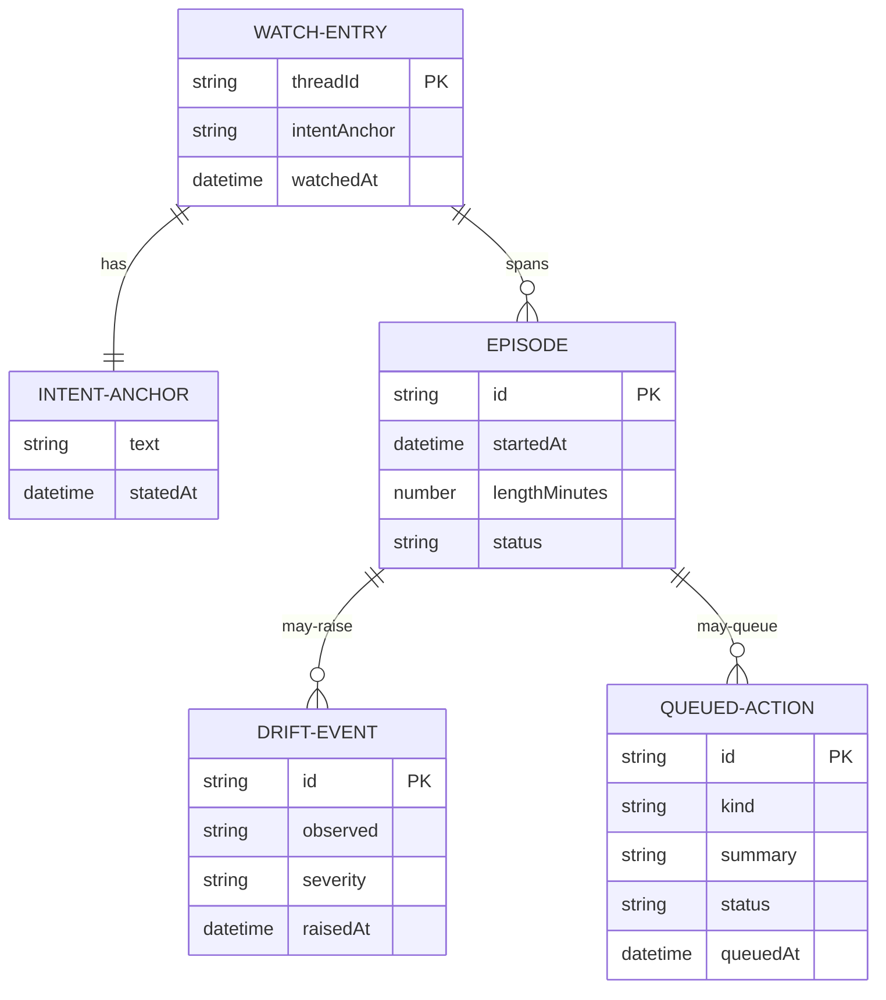

# Domain Model — L2 (developer ubiquitous language)

Formal model for developers and agents. L1 prose:
[DOMAIN-MODEL-L1.md](../DOMAIN-MODEL-L1.md).

## Aggregates

- **WatchEntry** (aggregate root) — one watched working thread: its intent
  anchor, its episodes. Created by `bb dkam watch`, destroyed by `bb dkam
  unwatch`. Lives in `bb.storage.kv` today, moving to plugin SQLite.
- **Episode** — a capped run of the working thread within a watch. Invariant:
  an episode has exactly one anchor at any time; crossing the length cap
  forces a boundary (re-grounding) before a new episode may start.
- **DriftEvent** — judgment that current activity diverges from the anchor.
  Invariant: never exists without an anchor.
- **QueuedAction** — a deferred consequential action. Invariant: never silent;
  it is created with a heads-up and leaves the queue only by operator review.

## Value objects

- **IntentAnchor** — immutable text + statedAt. Rewording it starts a new
  anchor revision; drift is always judged against the anchor in force.
- **Snapshot** — a rendered summary of Graph state at a moment. Immutable
  once produced.

## Services

- **GraphClient** — fetches and translates agent-graph's `Graph` JSON (the
  anticorruption layer). Sole integration point.
- **DriftWatcher** (TODO) — polls GraphClient per watch, compares against the
  anchor, raises DriftEvents, closes episodes at the cap.
- **PhoneChannel** (TODO) — delivers events over the websocket and captures
  voice.

## Domain events

See [DOMAIN-EVENTS.md](DOMAIN-EVENTS.md) for the cross-context table and
[events/](events/) for YAML specs.