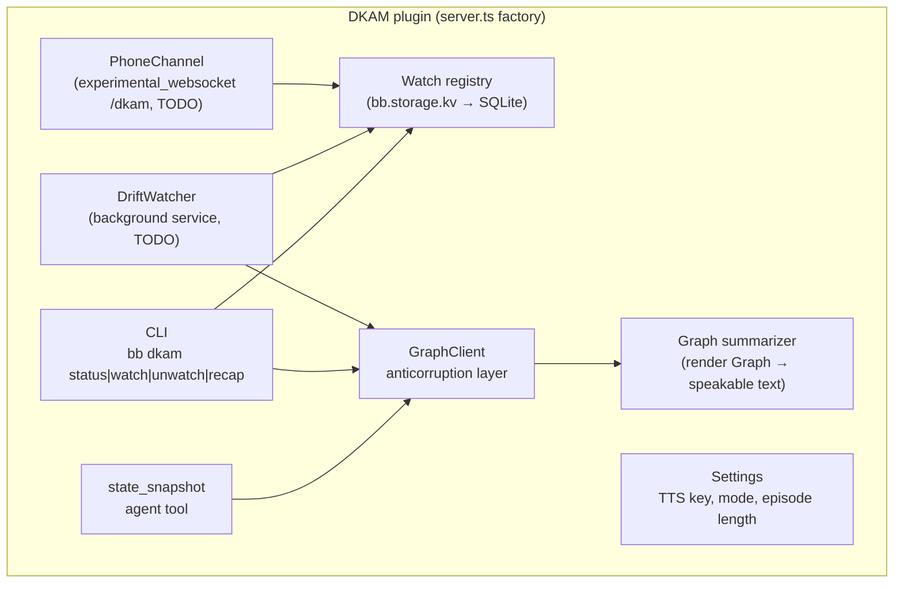
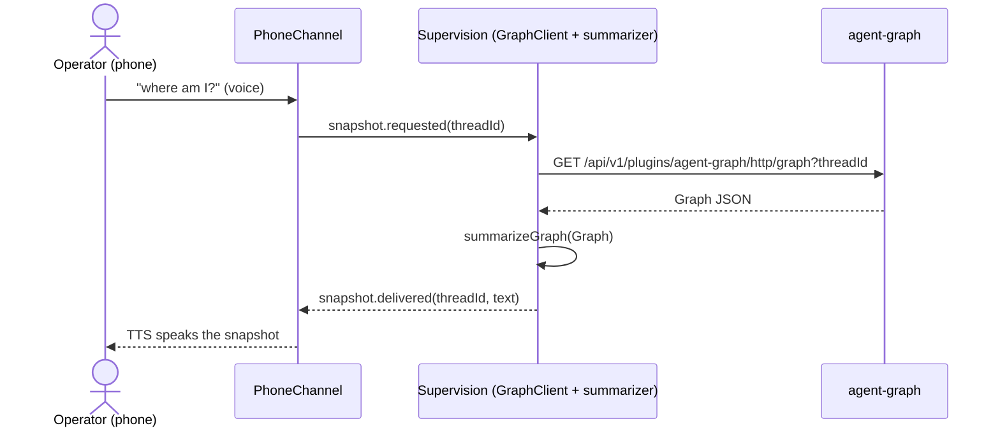
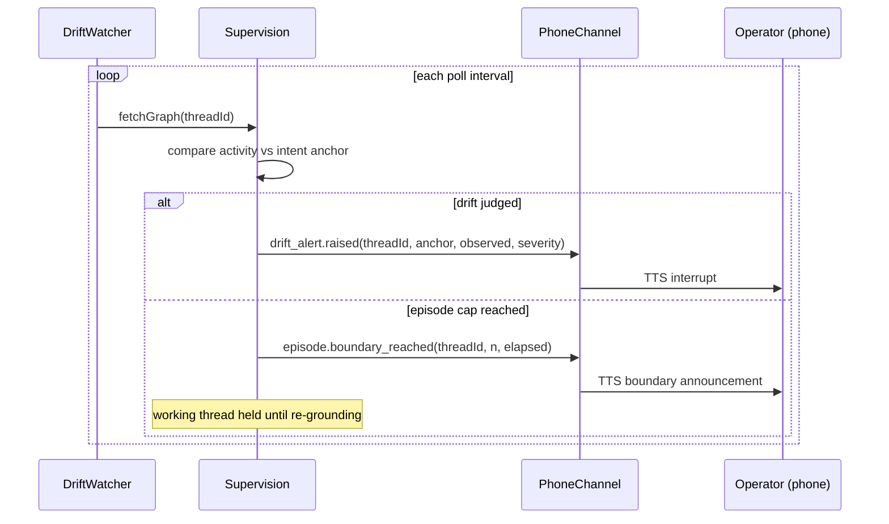

# C4: Components

Components inside the DKAM plugin container (see
[container.md](container.md)). Detail that exists in code is verifiable in
`server.ts`; TODO components are named with their planned registration.

| Component | Surface | Status |
|---|---|---|
| CLI | `bb.cli.register(defineCli(...))` | implemented |
| `state_snapshot` tool | `bb.agents.registerTool`, zod | implemented (stub output) |
| Watch registry | `bb.storage.kv` | implemented (KV) |
| Settings | `bb.settings.define` | implemented |
| GraphClient | `fetchGraph` + `summarizeGraph` in `server.ts` | fetch implemented; summarizer stub |
| DriftWatcher | `bb.background.service("drift-watcher")` | TODO |
| PhoneChannel | `bb.http.experimental_websocket("/dkam")` + HTML | TODO |
| Action queue | deferred consequential actions | TODO |

## Sequence: operator pulls a state snapshot

## Sequence: drift alert and episode boundary

Deployment and container views: [context.md](context.md),
[container.md](container.md), [deployment.md](deployment.md).