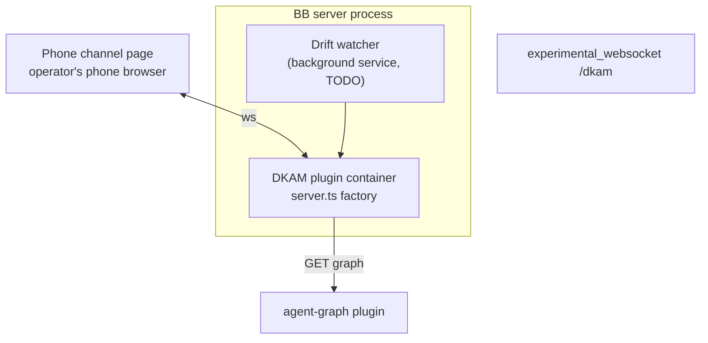

# C4: Containers

| Container | Description | Tech stack | Protocol |
|---|---|---|---|
| DKAM plugin | Backend entry loaded by the BB server; registers CLI, agent tool, settings, storage | TypeScript, Plugin SDK | in-process API |
| Drift watcher (TODO) | Long-lived service polling agent-graph per watched thread | Plugin SDK `bb.background.service` | in-process |
| Phone channel (TODO) | Served HTML page + websocket for TTS/voice | HTML, websocket | `experimental_websocket("/dkam")` |

Deployment view: [deployment.md](deployment.md).