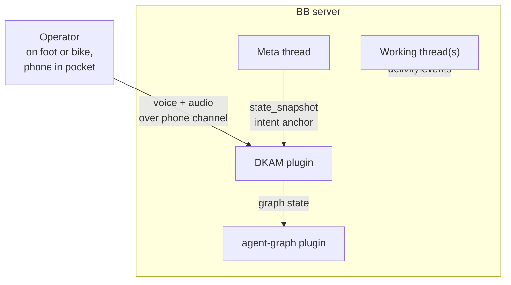

# C4: System context

## Context diagram

## Actors and external systems

- **Operator** — walking or biking; no screen, no keyboard. Interacts only by
  voice through the phone channel.
- **BB server** — hosts the plugin, the threads, and BB's voice transcription
  AI service.
- **agent-graph plugin** — external plugin serving the `Graph` JSON model of a
  thread's activity over `GET /api/v1/plugins/agent-graph/http/graph`.
- **TTS provider** — external text-to-speech API, keyed by the secret
  `ttsApiKey` setting (planned).

## Responsibilities

DKAM is responsible for: state snapshots, drift alerts, episode boundaries,
queued consequential actions, and the phone channel. It is NOT responsible
for narrating agent output or for doing the working thread's job.