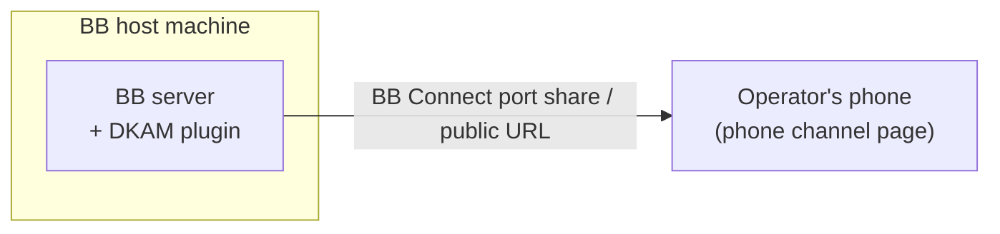

# C4: Deployment

- DKAM installs as a BB plugin (path install for development, git install for
  distribution). It runs inside the BB server process on the host machine.
- The phone channel must be reachable from the operator's phone. BB Connect
  (`bb connect expose <port>`) provides the remote URL; localhost URLs do not
  work remotely.
- No containers, no separate processes beyond BB's own background service
  worker for the plugin.
- Environments: the operator's main BB installation is the only deployment
  target today; a staging target will follow the two-stage pipeline mandate
  in `scripts/staging/`.